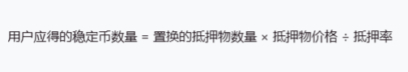

# Content/声明记录发放稳定币变量

接下来让我们回到***mintStableCoin***函数中来实现DAI的兑换逻辑。

首先我们需要计算兑换***collateralAmount***个抵押物可以换取多少个稳定币。这里的计算是根据抵押率来决定的。

所以我们这里的计算应该是将***collateralAmount***乘上价格price再除以抵押率。

还记得抵押率的定义是百分比的分子（整数）吗？由于我们这里是除以抵押率，所以我们再计算时需要先乘上100再除以抵押率***collateralRatio***。



**Syntax**

variable

- 提示
    
    ```solidity
    uint256 rewardStable = collateralAmount * price * 100 / collateralRatio;
    ```
    
