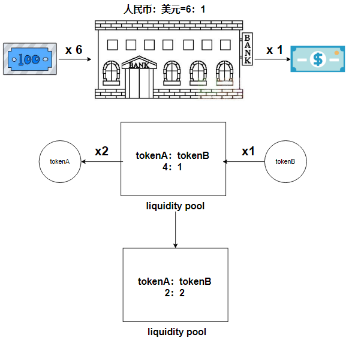

# Content/计算amountA应该能换出多少amountB

由于用户想要将***amountA***个A代币投入流动性池以换取相应的B代币，所以我们首先就要计算***amountA***个A代币能换取多少B代币。

这个计算逻辑其实在之前我们已经写过了，还记得***calculateAmountB***函数吗？它就是专门用来计算这个值的，如果有同学忘记了，可以倒回去看看***calculateAmount***章节的内容。



**Syntax**

function call

- 提示
    
    ```solidity
    uint256 amountB = calculateAmountB(amountA);
    ```
    
