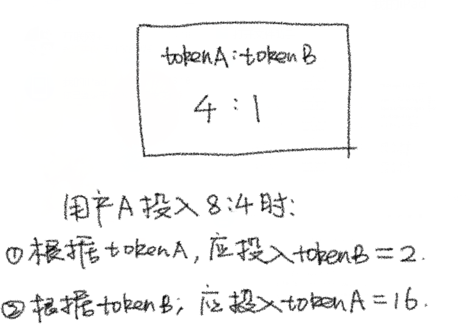

# Content/计算用户添加A代币时应该添加多少B代币

在上一节中，我们就算是写完了if里的逻辑。

接下来让我们进入到else分支，用户将投入资金到已初始化的流动性池中。

首先，我们需要计算用户希望投入的某个A代币的金额***_amountADesired***，以确定可以兑换多少个B代币。这是因为我们需要确保每次向流动性池中投入的两种代币具有相等的价值。

> 这就是为了保证添加流动性的过程不会对币价造成影响
> 

如果用户传入的***_amountADesired***的价值大于***_amountBDesired***的价值，我们不会将多余的***_amountADesired***投入流动性池。相反，我们会将与***_amountBDesired***等值的***amountAOptimal***投入流动性池。

在***amountB***⇒***amountA***的计算中，我们再次将其抽象为一个单独的功能函数***calculateAmountB***和***calculateAmountA***。

> 这两个函数会在后面的内容中讲到
> 

分别是用A代币的数量计算可以换出的B代币数量和用B代币数量计算可以换出的A代币数量。

在这里我们只需要将***_amountADesierd***作为参数传入***calculateAmountB***就可以得到***_amountADesierd***可以换取的B代币数量。



**Syntax Review**

function call

- 提示
    
    ```solidity
    calculate(amount)
    ```
    
