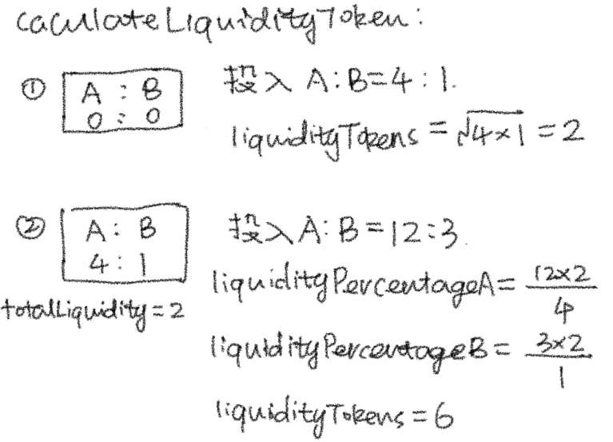

# Content/取较小的流动性代币数量

这时我们选择将***liquidityPercentageA***和***liquidityPercentageB***数额较大的直接作为Lp奖励代币的数额返回。

> 这里的计算方式可以根据开发时的需求做出相应的改变，在本教程中只是做了一个最简单的计算模型。
> 



**Syntax**

三元运算符

- 提示
    
    ```solidity
    //例如这里就是取a，b的最小值
    uint256 num = a < b ? a : b;
    ```
    
