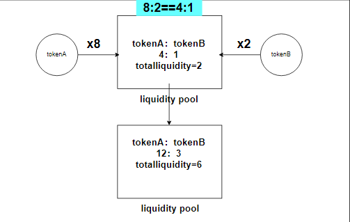

# Content/返回实际应该投入的代币A的数量

由于我们正在计算应该投入的 B 代币，所以我们可以通过将 B 的储备量乘以投入的A代币数量再除以 A 的储备量总数来获得应该投入的 B 代币数量。

你是否疑问为什么要这么计算？因为DEX模型在添加流动性时，要保持添加的代币比例与当前池子中的存储比例保持一致。例如：原来池子中代币比例为1:1，那么你添加时也应该保持1:1。

假设目前池子中代币比例为a:b,那么新添加的代币比例▲a:▲b==a:b,变化一下就得到了▲b=a*▲a/b。如下图：



最后，使用 return 语句将这个值作为函数的返回值即可。

**Syntax**

return

- 提示
    
    ```solidity
    return reserve * total;
    ```
    
